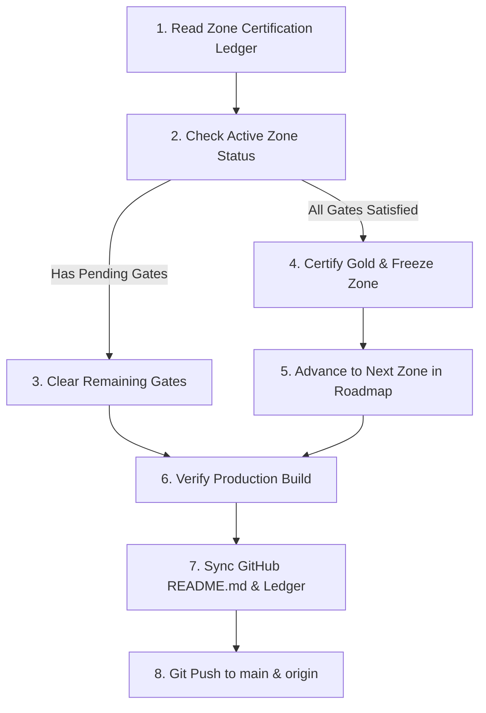

# 🏎️ AUTONOMOUS ZONE EXPANSION & AAA POLISH PLAYBOOK
### *The Definitive Autonomous Directive for Continuous Continental Expansion & Engine Refinement*
**Target Project:** Dreamstate Highway (Baja Racer 3D Engine)  
**Target Runtime:** Three.js (WebGL2) + Rapier Physics + Vite + Pure Web Audio API  
**Design Philosophy:** *OutRun* arcade spirit meets *Test Drive Unlimited* open road exploration, rendered in high-fidelity cel-shaded aesthetics.

---

## 🎯 Executive Summary & Creative North Star
Dreamstate Highway is an expansive, stylized 3D road trip simulator that captures the romance, speed, and cultural Americana of driving across the continent. 

As an autonomous AAA game studio engineer operating on a scheduled recurring cycle, **your mission is twofold**:
1. **Continuous Geographic Expansion**: Author and seamlessly integrate new iconic tourist regions, national parks, legendary highway corridors, and American/international road trip states.
2. **Relentless AAA Game Polish**: Elevate game feel, graphics, physics response, atmospheric depth, roadside micro-details, interactive tourist turnouts, procedural audio synthesis, and strict 60 FPS performance.

---

## 💎 The Golden Directive
Every scheduled execution cycle **MUST** fulfill both sides of the Golden Directive:
```
┌─────────────────────────────────────────────────────────────────────────────┐
│ 1. ✨ BRAND-NEW REGIONAL DISCOVERY                                           │
│    Introduce at least ONE completely new, authentic regional landmark,       │
│    scenic turnout, roadside wonder, or environmental feature that previously│
│    did not exist in the game.                                               │
├─────────────────────────────────────────────────────────────────────────────┤
│ 2. 🔨 DEEP REPOLISHING OF EXISTING WORLDS                                   │
│    Inspect and elevate prior zones: eliminate floating meshes with          │
│    subterranean foundations (Y ≤ -1.0m), enhance night emissives, add        │
│    micro-details (catenary wires, cat-eyes, guardrail bolts), or tune       │
│    weather/audio dynamics.                                                  │
└─────────────────────────────────────────────────────────────────────────────┘
```

## 🏁 The Milestone "Definition of Done" & Gold Certification Standard
To prevent the AI agent from getting trapped in endless micro-tweaks on the same zone, every zone adheres to an explicit, measurable **6-Gate Milestone Definition of Done**. 

A zone is officially declared **`🏅 GOLD CERTIFIED COMPLETE`** when—and only when—it satisfies all 6 gates:

```
┌─────────────────────────────────────────────────────────────────────────────┐
│                       THE 6-GATE GOLD CERTIFICATION                         │
├─────────────────────────────────────────────────────────────────────────────┤
│ 🛣️ GATE 1: HIGHWAY & SPLINE CONTINUITY                                      │
│   • Full 2,600m continuous Catmull-Rom spline with natural banking & grade. │
│   • Pavement detailing: double yellow centerline, edge lines, road shoulder.│
│                                                                             │
│ 🏛️ GATE 2: ANCHOR LANDMARKS (THE "RULE OF THREE")                            │
│   • Exactly 3 distinct, culturally authentic procedural 3D landmarks.       │
│   • Cel-shaded toon materials + dusk/night window or neon emissive glow.    │
│   • Distinct silhouettes visible from 400m+ down the highway corridor.      │
│                                                                             │
│ 🔭 GATE 3: SCENIC TURNOUTS & INTERACTIVE POIs                                │
│   • At least 2 paved/timber turnouts registered in SCENIC_PARKING_LOTS.     │
│   • Turnout entrance / advance highway signs installed.                     │
│   • Interactive coin-op telescope/binoculars with camera focus & zoom FOV.  │
│   • Historical interpretive kiosk with lore plaque in HistoricalLore.js.    │
│   • Bespoke procedural canvas postcard rendered in LandmarkPhotos.js.       │
│                                                                             │
│ 🌦️ GATE 4: BIOME & AUDIO IDENTITY                                          │
│   • Dedicated sky gradient & atmospheric haze registered in constants.js.   │
│   • Regional flora kit (instanced palms, pines, cacti, or redwoods).        │
│   • Environmental Web Audio synthesis (wind rush, surf, river, rain/snow). │
│                                                                             │
│ 🎬 GATE 5: DISCOVERY & SIGNATURE CINEMATIC VIGNETTE                         │
│   • At least 1 off-road trail, secret vista, or hidden excursion.           │
│   • Exactly ONE Interactive Cinematic Vignette triggered by the player      │
│     interacting with a world item, landmark, or scenic turnout.             │
│   • Engages letterbox overlay (#hud-cutscene-overlay), multi-shot camera,   │
│     animated 3D actors/props, narrative subtitles, and audio cues.          │
│                                                                             │
│ 🛡️ GATE 6: TECHNICAL & PERFORMANCE SEAL                                      │
│   • Subterranean foundation rule verified: all skirts sink Y ≤ -1.0m.       │
│   • Static batching verified: collapsed to ≤ 3 draw calls per 500m chunk.   │
│   • Zero NaN coordinates, zero memory leaks, and 60 FPS maintained.         │
│   • Clean production build passes (npm run build).                          │
└─────────────────────────────────────────────────────────────────────────────┘
```

## 🛑 The Hard Scope Budget & Cut-Off Mechanism (How We Stop Endless Building)
To eliminate scope creep and ensure the game constantly moves forward across America, each zone is governed by strict **Quantitative Quotas** and a **Hard 2-Cycle Timebox**:

### 1. The Quantitative Feature Quota (Exact Min & Max Caps)
An agent is **FORBIDDEN** from exceeding these exact caps for any single 2,600-meter zone:

| Zone Feature | Minimum Required | Strict Maximum Cap | Why This Cap Exists |
|:---|:---:|:---:|:---|
| **Major Anchor Landmarks** | **3** | **3 (HARD CAP)** | **Highway Pacing Rule**: At 120 km/h, 3 landmarks spaced ~800m apart provides the ideal 25-second cinematic reveal rhythm. A 4th creates visual clutter and draw-call saturation. |
| **Scenic Turnouts (Parking Lots)** | **2** | **2 (HARD CAP)** | Registered in `SCENIC_PARKING_LOTS`. 1 on the left side, 1 on the right side. |
| **Off-Road Trails / Secret Spurs** | **1** | **1 (HARD CAP)** | 1 technical 4x4 trail, 1 secret overlook, or 1 hidden wilderness spur. |
| **Interactive Cinematic Scene** | **1** | **1 (HARD CAP)** | **Narrative Punch**: 1 player-triggered cutscene (like the Mojave mob scene) anywhere in the zone. |
| **Historical Lore Plaques** | **2** | **3 (HARD CAP)** | Authored in `HistoricalLore.js` matching the turnouts. |
| **Procedural Postcard Photos** | **2** | **3 (HARD CAP)** | Rendered in `LandmarkPhotos.js` matching the landmarks. |
| **Static Draw Calls / Chunk** | — | **≤ 3 (REDLINE)** | Verified via `batchChunkStaticMeshes()` in `main.js`. |

> [!IMPORTANT]
> **The Hard Cut-Off Rule**: As soon as a zone reaches **3 Major Landmarks**, **2 Turnouts**, **1 Off-Road POI**, and **1 Interactive Cinematic Scene**, its feature count is **100% FULL**. The agent is strictly barred from building any additional structures, lots, or attractions in that zone.

---

### 2. 🎬 The Interactive Cinematic Vignette System (Every Zone's Narrative Signature)
Every zone must include **exactly one** cinematic vignette, continuing the GTA/OutRun-style narrative flavor established by the Mojave mob standoff:

* **Player-Triggered Agency**: The scene does not interrupt driving automatically. It is triggered when the player chooses to interact with a specific world object (e.g. parking at a specific spot, approaching an abandoned car, inspecting a locked gate, or looking through a high-power telescope).
* **Cinematic Engine Integration**:
  ```javascript
  // Trigger pattern in zone manager or scenery builder:
  gameState.isCutsceneActive = true;
  gameState.cutsceneName = 'zoneX_vignette_id';
  gameState.cutsceneDuration = 12.0; // 10-15 seconds recommended
  gameState.cutsceneTitleCard = '🎬 TITLE OF THE CINEMATIC';
  gameState.cutsceneSubtitles = 'Subtitles describing narrative action...';
  ```
* **Camera & Actor Choreography**:
  - Activates widescreen letterbox bars (`#hud-cutscene-overlay`).
  - Cuts to 2–3 authored dynamic camera angles (establishing shot $\to$ medium action shot $\to$ departure shot).
  - Animates simple procedural actors (moving getaway boats/cars, blinking electronics, opening gates, steam releases, searchlights).
  - Rewards the player: updates the in-dash tablet casefiles or awards bonus discovery score upon completion.

#### 🌟 Continental Cinematic Vignette Presets:
- **Zone 0 (Mojave Desert)**: *Arrowhead Canyon Mob Murder & Standoff* (witnessing the desert transaction, gun draw, and peel-out).
- **Zone 1 (Malibu & PCH)**: *Billionaire's Carbon Beach Yacht Drop* (pulling up to a dark villa triggers a high-speed cigarette boat flashing signals and dropping a waterproof briefcase onto the sands).
- **Zone 2 (Big Sur)**: *Ghost of Point Sur Lighthouse* (approaching the foggy cliff at dusk triggers a foghorn groan, the lighthouse beam sweeping through mist, and a spectral 1930s coastal schooner vanishing in the surf).
- **Zone 3 (Monterey & Carmel)**: *Cannery Row Bootlegger Switcher* (inspecting the rusty rail switcher blows steam, starts the locomotive chug, and reveals shadowy figures loading sardine contraband into an old panel truck).
- **Zone 4 (NorCal & Marin)**: *Marin Headlands Cold War Radar Intercept* (stopping at the concrete WWII bunker and flipping a breaker spins the radar dish, crackling with decrypted Cold War shortwave radio chatter).
- **Zone 5 (Redwood Forest)**: *Colossal Timber Fall & Sasquatch Sighting* (driving into a secluded grove triggers camera screen-shake as an ancient redwood branch crashes down, revealing a shadowy biped silhouette slipping between the giant trunks).
- **Zone 6 (Oregon Coast)**: *Haystack Rock Coast Guard Flare Drop* (parking at the tidepool beach fires an emergency red flare arc over the sea stacks, revealing a distressed trawler swept by rescue helicopter searchlights).
- **Zone 7 (Columbia Gorge)**: *Crown Point Barnstormer Biplane Stunt* (stopping at Vista House in 45 MPH gusts reveals a vintage biplane diving under the Benson Bridge over Multnomah Falls in a dramatic stunt).
- **Zone 8 (Puget Sound & Seattle)**: *Pike Place Pier Syndicate Sting* (parking near the ferry terminal slip flickers the pier lamps as undercover cruisers trap a courier beneath the neon market sign).
- **Zone 9 (Mount Rainier Pass)**: *Glacial Avalanche Snow Shed Thunder* (approaching the avalanche gallery triggers roaring rumble physics and cascading snow particles across the brutalist concrete roof).

---

### 3. The 2-Cycle Maximum Timebox (Forced Progression)
To prevent an agent from endlessly tweaking lighting or materials on the same 3 buildings, every zone is timeboxed to a **maximum of 2 scheduled runs**:

```
┌─────────────────────────────────────────────────────────────────────────────┐
│ CYCLE 1: THE CONSTRUCTION SPRINT                                            │
│   • Pave 2,600m Catmull-Rom spline curve & elevation profile.               │
│   • Build exactly 3 anchor landmarks + 2 scenic turnouts.                   │
│   • Set sky gradient, fog colors, and flora in constants.js.                │
├─────────────────────────────────────────────────────────────────────────────┤
│ CYCLE 2: THE POLISH & CERTIFICATION SPRINT                                  │
│   • Sink all foundations (Y ≤ -1.0m) to eliminate terrain gaps.             │
│   • Add 2 lore plaques (HistoricalLore.js) & 2 postcards (LandmarkPhotos.js)│
│   • Verify static batching, run `npm run build`, sign off all 6 gates.      │
│   • UPDATE LEDGER TO `🏅 GOLD CERTIFIED` & FREEZE ZONE.                     │
├─────────────────────────────────────────────────────────────────────────────┤
│ CYCLE 3+: FORCED AUTO-ADVANCE                                               │
│   • The agent is BLOCKED from opening the previous zone.                    │
│   • MUST immediately begin Cycle 1 of the NEXT zone in the roadmap!        │
└─────────────────────────────────────────────────────────────────────────────┘
```

---

## 🔒 The Zone Freeze & Auto-Progression Law
To enforce steady forward momentum across the continental highway:

1. **The Zone Freeze Rule**:
   - Once a zone satisfies all 6 gates (or finishes its 2nd cycle), its status is updated in the [Zone Certification Ledger](#-active-zone-certification-ledger) to **`🏅 GOLD CERTIFIED COMPLETE`**.
   - **`GOLD CERTIFIED` zones are permanently FROZEN.**
   - The agent is **STRICTLY FORBIDDEN** from modifying, redesigning, adding props to, or refactoring frozen zones, unless fixing a game-breaking crash or critical engine regression.

2. **The Auto-Advance Trigger**:
   - On every scheduled run, the agent inspects the ledger below.
   - If the current active zone has reached `GOLD CERTIFIED`, the agent **MUST IMMEDIATELY ADVANCE** to the next zone on the Continental Roadmap.
   - If all active zones are certified, the agent automatically roughs in the next planned corridor from the roadmap!

---

## 📊 Active Zone Certification Ledger & Status Matrix

| Zone # | Region Name | Corridor | Status | Remaining Gates | Next Actionable Target |
|:---:|:---|:---|:---:|:---:|:---|
| **0** | Mojave Desert & Route 66 | Pacific Coast | `🏅 GOLD CERTIFIED` | None (All 6 Passed) | **FROZEN** — Do Not Modify |
| **1** | Malibu & Pacific Coast Highway | Pacific Coast | `🏅 GOLD CERTIFIED` | None (All 6 Passed) | **FROZEN** — Do Not Modify |
| **2** | Big Sur Highway 1 | Pacific Coast | `🏅 GOLD CERTIFIED` | None (All 6 Passed) | **FROZEN** — Do Not Modify |
| **3** | Monterey Bay & Carmel | Pacific Coast | `🏅 GOLD CERTIFIED` | None (All 6 Passed) | **FROZEN** — Do Not Modify |
| **4** | NorCal & Marin | Pacific Coast | `🏅 GOLD CERTIFIED` | None (All 6 Passed) | **FROZEN** — Do Not Modify |
| **5** | Redwood Forest / Avenue of Giants | Pacific Coast | `🏅 GOLD CERTIFIED` | None (All 6 Passed) | **FROZEN** — Do Not Modify |
| **6** | Oregon Coast & Cannon Beach | Pacific Coast | `🏅 GOLD CERTIFIED` | None (All 6 Passed) | **FROZEN** — Do Not Modify |
| **7** | Columbia River Gorge | Pacific Coast | `🏅 GOLD CERTIFIED` | None (All 6 Passed) | **FROZEN** — Do Not Modify |
| **8** | Washington & Puget Sound | Pacific Coast | `🏅 GOLD CERTIFIED` | None (All 6 Passed) | **FROZEN** — Do Not Modify |
| **9** | Cascade Pass & Mount Rainier | Northern Rockies | `🏅 GOLD CERTIFIED` | None (All 6 Passed) | **FROZEN** — Do Not Modify |
| **10** | Idaho Panhandle & Coeur d'Alene | Northern Rockies | `🏅 GOLD CERTIFIED` | None (All 6 Passed) | **FROZEN** — Do Not Modify |
| **11** | Montana Big Sky & Glacier | Northern Rockies | `🏅 GOLD CERTIFIED` | None (All 6 Passed) | **FROZEN** — Do Not Modify |
| **12** | Las Vegas Strip & Red Rock Canyon | Southwest Red Rock | `🏅 GOLD CERTIFIED` | None (All 6 Passed) | **FROZEN** — Do Not Modify |
| **13** | Zion Canyon & Checkerboard Mesa | Southwest Red Rock | `🏗️ NEXT UP` | Gates 1–6 Pending | Corridor B: Soaring Navajo Sandstone Monoliths & Pine-Fringed Slickrock |

*(Note: When an agent completes a zone's remaining gates, it must update this matrix in the MD file to mark it `🏅 GOLD CERTIFIED`, commit, and begin work on the next zone!)*

---

## 🤖 Scheduled Task Autonomous Execution Runbook
When waking up on a scheduled run, the agent must execute this deterministic 6-step loop:



### Step 1: Read the Certification Ledger
1. Open this playbook (`AUTONOMOUS_ZONE_EXPANSION_PLAYBOOK.md`) and consult the **Active Zone Certification Ledger**.
2. Identify the first zone that is NOT `🏅 GOLD CERTIFIED`.

### Step 2: Determine Scheduled Mission
- **Scenario A (Active Zone In-Progress)**: The active zone has unmet milestone gates. The agent must focus 100% of this scheduled run on clearing those specific remaining gates (e.g. adding the 3rd anchor landmark, authoring the missing historical lore plaque, or verifying static batching).
- **Scenario B (Active Zone Reached Gold)**: All 6 gates for the active zone are now verified. The agent marks it `🏅 GOLD CERTIFIED` in the ledger, freezes it, and advances to the next planned zone.
- **Scenario C (New Zone Initiation)**: The previous zone is frozen; the agent initiates the next zone from the Continental Roadmap using the 7-File Contract (extending road spline, adding zone config to `constants.js`, and creating the new Scenery Builder).

### Step 3: Architectural Implementation (The 7-File Contract)
When authoring or completing a zone, touch the 7 core architectural touchpoints (see [Section 5](#-the-7-file-architecture-contract)).

### Step 4: AAA Polish & Static Batching
1. Ensure all static scenery meshes are eligible for `batchChunkStaticMeshes()` in `src/main.js` (collapsing draw calls to $\le 3$ per 500m chunk).
2. Ensure every structure has subterranean foundation geometry ($Y \le -1.0\text{m}$) to guarantee zero floating gaps on sloping terrain.
3. Add interactive elements: turnouts (`SCENIC_PARKING_LOTS`), historical plaques (`HistoricalLore.js`), and postcard art (`LandmarkPhotos.js`).

### Step 5: Verification & Safety Check
1. Verify no syntax errors or NaN values in spline calculations.
2. Verify production build succeeds: run `npm run build` to ensure Vite bundles clean with zero compilation errors.
3. Clean up any temporary build servers or background processes. *(Note: User conducts live hardware playtesting; do not leave background servers dangling).*

### Step 6: Synchronize GitHub README.md & Active Ledger
Always keep the repository's public documentation in sync with all changes made during this run or by recent community contributors:
1. **Sync `README.md` Zone Table**:
   - Update the **Zone Table** (`## 🗺️ The Zones (Pacific Coast Highway Corridor)`) to reflect all active zones, new distance ranges, weather badges, and iconic landmarks.
   - Update the total highway distance (e.g. `26,000 meters` $\to$ `28,600 meters`) and total zone count across the README header and summary.
2. **Document New Features & Options**:
   - Check if this run or recent contributors added new features, gameplay mechanics, vehicle models, paint liveries, camera options, radio stations, or controls.
   - Add or update entries under `## ⚡ Core Features` or the relevant documentation tables in `README.md`.
3. **Update the Certification Ledger**:
   - Update the **Active Zone Certification Ledger** in this playbook with completed gates or new `🏅 GOLD CERTIFIED` statuses.

### Step 7: Git Sync to Main & Origin
Commit all changes (code, playbook ledger, and `README.md`) and push in lockstep:
```bash
git add .
git commit -m "feat(expansion): [Zone Name] — [Gates Completed / Gold Certified & README synced]"
git push origin main
```
Both local `main` and `origin/main` must remain synchronized in lockstep.

---

## 🗺️ Master Continental Expansion Roadmap

### 📍 Current Foundation: Pacific Coast Highway (Zones 0 – 8)
- **Zone 0 (0m – 2,600m)**: Mojave Desert & Route 66 (Cabazon Dinosaurs, Roy's Motel, Coyote Ridge 4x4).
- **Zone 1 (2,600m – 5,200m)**: Malibu & PCH (Santa Monica Pier, Duke's, Carbon Beach Villas).
- **Zone 2 (5,200m – 7,800m)**: Big Sur Highway 1 (Bixby Creek Bridge, McWay Falls, Nepenthe).
- **Zone 3 (7,800m – 10,400m)**: Monterey Bay & Carmel (Cannery Row, 17-Mile Drive, Lone Cypress).
- **Zone 4 (10,400m – 13,000m)**: NorCal & Marin (Golden Gate Bridge, Painted Ladies, Sonoma Chateaus).
- **Zone 5 (13,000m – 15,600m)**: Redwood Forest (Chandelier Drive-Thru Tree, Avenue of the Giants).
- **Zone 6 (15,600m – 18,200m)**: Oregon Coast (Haystack Rock, Yaquina Head Lighthouse, Tillamook).
- **Zone 7 (18,200m – 20,800m)**: Columbia River Gorge (Multnomah Falls, Vista House, Bridge of the Gods).
- **Zone 8 (20,800m – 23,400m)**: Washington & Puget Sound (Snoqualmie Falls, Space Needle, Pike Place Market).

---

### 🌲 Expansion Corridor A: Pacific Northwest to Northern Rockies (Zones 9 – 11)
*Connecting Puget Sound across the Cascades and Idaho Panhandle into Montana's Crown of the Continent.*

#### 🏔️ Zone 9: Cascade Alpine Pass & Mount Rainier (23,400m – 26,000m)
- **Theme**: Sub-alpine meadows, glacial streams, snow sheds, and towering volcanic summits.
- **Atmosphere & Weather**: Crisp alpine mist, blowing flurry particles, dramatic alpenglow on snow peaks.
- **Key Landmarks**:
  - *Paradise Valley Lodge*: Timber-and-stone rustic national park lodge with roaring stone hearth.
  - *Reflection Lakes Overlook*: Mirrored alpine lake reflecting Mount Rainier's glaciated crater.
  - *Narada Falls Basalt Chasm*: Plunging waterfall through columnar basalt walls with rainbow mist spray.
  - *Concrete Avalanche Snow Shed*: Brutalist alpine highway gallery protecting road from snow slides.
- **Road Characteristics**: High-elevation banked hairpin curves, snow banks along road shoulders, reduced tire grip (`0.82`).

#### 🪵 Zone 10: Idaho Panhandle & Lake Coeur d'Alene (26,000m – 28,600m)
- **Theme**: Inland Northwest timber country, deep sapphire lakes, floating boardwalks, historic mining.
- **Atmosphere & Weather**: Clear mountain pine air, scent of cedar, crystal-clear water reflections.
- **Key Landmarks**:
  - *Lake Coeur d'Alene Floating Boardwalk*: Expansive wooden marina and lakeside resort boardwalk.
  - *Cataldo Old Mission*: Idaho's oldest standing building, historic wattle-and-daub Jesuit church.
  - *Silver Valley Mine Headframe & Ore Chutes*: Weathered corrugated steel mining complex.
  - *Wallace Historic Downtown*: 1890s brick commercial storefronts claiming "Center of the Universe".
- **Road Characteristics**: Sweeping shoreline curves, timber trestle highway bridges, gravel turnouts.

#### 🦬 Zone 11: Montana Big Sky & Glacier Going-to-the-Sun (28,600m – 31,200m)
- **Theme**: Jagged glacial cirques, weeping walls, mountain goats, alpine tundra.
- **Atmosphere & Weather**: Vast cobalt skies, swift scudding storm clouds, biting crisp wind (`windForce: 24`).
- **Key Landmarks**:
  - *Logan Pass Continental Divide (6,646 ft)*: Alpine visitor center perched on the high mountain pass.
  - *The Weeping Wall*: Sheer rock face with natural spring waterfalls pouring onto highway road edge.
  - *Lake McDonald Cedar Chalets & Colored Pebbles*: Turquoise glacial lake shore with rainbow pebble beds.
  - *Triple Arches Highway Gallery*: Iconic stonework arches built directly into vertical cliff walls.
- **Road Characteristics**: Sheer drop-off rock walls with low stone guardrails, narrow two-lane mountain pass.

---

### 🏜️ Expansion Corridor B: The Southwest Red Rock & Canyonlands (Zones 12 – 15)
*Venturing through Nevada neon, Utah's sandstone labyrinths, and Arizona's geological wonders.*

#### 🎰 Zone 12: Las Vegas Strip & Red Rock Canyon (31,200m – 33,800m)
- **Theme**: Mid-century neon spectacle contrasting with high-desert red Aztec sandstone bluffs.
- **Atmosphere & Weather**: Hot desert dusk fading into electrifying neon night (`heatShimmer: 0.28`).
- **Key Landmarks**:
  - *Welcome to Fabulous Las Vegas Sign*: Iconic diamond neon sign with starburst top.
  - *The Strip Boulevard Architecture*: Giant stylized pyramids, replica Eiffel Tower, dancing fountain lake.
  - *Red Rock Canyon Scenic Loop*: Crimson-banded sandstone peaks and desert tortoise crossings.
  - *Atomic Testing Museum & Retro Diner*: 1950s Googie architecture and mushroom cloud signpost.
- **Road Characteristics**: Multi-lane wide neon boulevard transitioning into winding single-lane red rock canyon.

#### 🏜️ Zone 13: Zion Canyon & Checkerboard Mesa (33,800m – 36,400m)
- **Theme**: Soaring Navajo sandstone monoliths, pine-fringed slickrock, stone tunnels.
- **Atmosphere & Weather**: Brilliant amber-orange bounce light, narrow canyon sky slits.
- **Key Landmarks**:
  - *Zion-Mount Carmel Tunnel*: Historic 1.1-mile rock tunnel with arched observation windows carved in cliff faces.
  - *The Great White Throne & Angels Landing*: Monumental 2,400-foot sheer monolith towers.
  - *Checkerboard Mesa*: Cross-bedded sandstone dome with geometric weathered grid pattern.
  - *Virgin River Narrows Footbridge*: River cobble suspension footbridge spanning canyon narrows.
- **Road Characteristics**: Red-pigmented asphalt, tunnel portals with dynamic lighting transitions.

#### 🦅 Zone 14: Grand Canyon South Rim & Desert View (36,400m – 39,000m)
- **Theme**: One of the seven natural wonders of the world; mile-deep layered geological chasm.
- **Atmosphere & Weather**: Infinite horizon haze, soaring thermal updrafts, golden hour canyon shadows.
- **Key Landmarks**:
  - *Desert View Watchtower*: Mary Colter's 1932 four-story stone ancestral Puebloan-style tower.
  - *Mather Point Rim Promontory*: Cantilevered stone observation overlook over the canyon abyss.
  - *El Tovar Historic Hotel*: Dark log and Oregon pine luxury rustic lodge on the canyon rim.
  - *Grand Canyon Railway Steam Train Depot*: Vintage steam locomotive and passenger cars.
- **Road Characteristics**: Scenic rim drive with split-rail log fences and frequent panoramic turnout loops.

#### 🏜️ Zone 15: Monument Valley & Navajo Nation (39,000m – 41,600m)
- **Theme**: The spiritual heart of Western cinema; towering red sandstone buttes rising from desert floor.
- **Atmosphere & Weather**: Deep terra-cotta dust, wide-open turquoise skies, solitary desert silence.
- **Key Landmarks**:
  - *The Mittens & Merrick Butte*: Iconic twin sandstone buttes with distinct thumb spires.
  - *Forrest Gump Point (Highway 163)*: The legendary long, straight descending highway vista into the valley.
  - *Goulding's Trading Post & Stagecoach Lodge*: Historic 1920s trading post and John Wayne film cabin.
  - *Navajo Hogan Traditional Dwelling*: Hexagonal cedar-log and earth ceremonial structures.
- **Road Characteristics**: Long, cinematic straightaways over undulating desert swells, red dirt road shoulders.

---

### 🏔️ Expansion Corridor C: Rocky Mountain High & Colorado Passes (Zones 16 – 18)
*Ascending above the tree line into the highest paved roads in North America.*

#### 🍂 Zone 16: Rocky Mountain Trail Ridge Road & Aspen Pass (41,600m – 44,200m)
- **Theme**: 12,000-foot alpine tundra, golden quaking aspen groves, continental divide crossings.
- **Atmosphere & Weather**: Dazzling thin-air sunlight, howling pass gusts, fluttering golden aspen leaves.
- **Key Landmarks**:
  - *Alpine Visitor Center (11,796 ft)*: The highest national park facility in North America.
  - *Maroon Bells Overlook*: World's most photographed peaks mirrored in a pristine beaver pond.
  - *Historic Aspen Silver Boom Victorian Main Street*: Brick opera houses and gingerbread mining mansions.
  - *Continental Divide Milner Pass Monument*: Marker where water divides between Atlantic and Pacific oceans.
- **Road Characteristics**: Continuous switchbacks above tree line, zero guardrails against sheer drop-offs, tundra flora.

#### 🎸 Zone 17: Red Rocks Amphitheatre & Front Range (44,200m – 46,800m)
- **Theme**: Colossal 300-foot acoustic sandstone monoliths, open-air concerts, high plains vista.
- **Atmosphere & Weather**: Vibrant sunset glow, concert stage lights cutting into twilight sky.
- **Key Landmarks**:
  - *Red Rocks Concert Stage*: Natural amphitheater between Ship Rock and Creation Rock.
  - *Dinosaur Ridge Trackway*: Prehistoric fossilized dinosaur tracks embedded in sandstone tilting slabs.
  - *Buffalo Bill's Lookout Mountain Memorial*: Stone museum overlooking the Great Plains and Denver skyline.
  - *Coors Golden Brewery Silos & Clear Creek*: Historic copper kettle brewery along mountain stream.
- **Road Characteristics**: Dynamic elevation climbing, rock tunnels, stadium lighting glows at dusk.

#### 🏎️ Zone 18: Pikes Peak Highway & Garden of the Gods (46,800m – 49,400m)
- **Theme**: The historic Race to the Clouds; 156 turns to a 14,115-foot summit.
- **Atmosphere & Weather**: Frigid thin atmosphere, swirling vortex clouds, gravel runoff aprons.
- **Key Landmarks**:
  - *Garden of the Gods Balanced Rock*: Impossibly perched 700-ton red sandstone boulder.
  - *Pikes Peak Hillclimb Start Line*: Rally timing gates, spectator bleachers, and rally banners.
  - *Devil's Playground Switchbacks*: Hairpin curves above 13,000 feet with rally braking marks.
  - *Summit House Observatory (14,115 ft)*: Steel and glass summit center with panoramic views of four states.
- **Road Characteristics**: Extreme 10% uphill grades, tight 180° hairpin switchbacks, rally racing surface texture.

---

### 🛣️ Expansion Corridor D: Route 66 Heartland to Chicago (Zones 19 – 21)
*The historic Mother Road from Texas Panhandle ranches to the shores of Lake Michigan.*

#### 🎨 Zone 19: Texas Panhandle & Cadillac Ranch (49,400m – 52,000m)
- **Theme**: Route 66 roadside eccentric Americana, flat horizon cattle country, neon steak houses.
- **Atmosphere & Weather**: Golden wheat blowing in wind, massive thunderstorms on the horizon.
- **Key Landmarks**:
  - *Cadillac Ranch*: Ten graffiti-covered Cadillacs buried nose-down in the desert soil.
  - *Big Texan Steak Ranch*: Giant fiberglass cowboy and 72-oz steak challenge arena.
  - *Route 66 Midpoint Cafe (Adrian, TX)*: "1,139 miles to Chicago, 1,139 miles to Los Angeles" sign.
  - *Giant Cross of Groom*: 190-foot white steel cross standing sentinel over the plains.

#### 🏛️ Zone 20: St. Louis & The Gateway Arch (52,000m – 54,600m)
- **Theme**: Gateway to the West, Mississippi riverboats, historic brick breweries.
- **Atmosphere & Weather**: Humid river breeze, dramatic lightning over river waters.
- **Key Landmarks**:
  - *The Gateway Arch (630 ft)*: Monumental stainless steel catenary arch reflecting sky and river.
  - *Eads Bridge*: Historic 1874 steel arch bridge over the muddy Mississippi River.
  - *Historic Delta King Paddlewheel Riverboat*: Steamboat with massive red paddlewheel.
  - *Anheuser-Busch Romanesque Brick Brewery*: Ornate red-brick brew house with clock tower.

#### 🏙️ Zone 21: Chicago Lake Shore Drive & Route 66 Start (54,600m – 57,200m)
- **Theme**: Art Deco skyscrapers, magnificent mile, Lake Michigan shoreline, neon jazz clubs.
- **Atmosphere & Weather**: Gusty "Windy City" breeze, reflective skyscraper glass, shimmering blue lake.
- **Key Landmarks**:
  - *Route 66 Begin Sign (Adams & Michigan Ave)*: Historic Mother Road origin marker.
  - *The Cloud Gate ("The Bean") & Millennium Park*: Mirrored stainless steel sculpture reflecting city skyline.
  - *Navy Pier & Centennial Wheel*: Pier stretching into Lake Michigan with illuminated Ferris wheel.
  - *Lake Shore Drive Skyline Boulevard*: Sweeping multi-lane expressway hugging Lake Michigan.

---

## 🏗️ The 7-File Architecture Contract
When introducing any new zone (e.g. Zone 9: Cascade Pass), you must update these exact 7 files:

### 1. `src/constants.js`
Add zone configuration object to `ZONES` array and landmarks to `LANDMARKS`:
```javascript
// In ZONES array:
{
  id: 9,
  name: 'CASCADE ALPINE PASS & RAINIER',
  sub: 'Mount Rainier & Paradise Valley',
  temperature: '34°F',
  tempC: '1°C',
  tempLabel: '34°F • ALPINE FLURRIES',
  skyTop: '#0c2238',
  skyMid: '#244866',
  skyHorizon: '#6e8ea8',
  hazeColor: '#90a8be',
  fogColor: '#7a96ae',
  fogNear: 220,
  fogFar: 2000,
  sunColor: '#fff2db',
  ambientColor: '#bed3e0',
  groundColor: '#78887a',
  roadColor: '#303438',
  rockColor: '#4a5056',
  plantType: 'alpine_larch',
  lengthMeters: 2600,
  cloudType: 'alpine_stratus',
  cloudDensity: 0.75,
  cloudScale: 1.30,
  cloudSpeed: 1.1,
  heatShimmer: 0.0,
  mieG: 0.74,
  sunGlow: 1.05,
  starVisibility: 0.05,
  alpenglowColor: '#f7c0b0',
  roadGrip: 0.82,
  windForce: 18.0,
  windAngle: 1.57,
  precipitation: 'snow',
  heatRateMult: 0.70,
  coolRateMult: 1.50,
  weatherBadge: '❄️ 34°F • ALPINE FLURRIES • GRIP 82%',
}

// In LANDMARKS array:
{ id: 'paradise_lodge', name: 'Paradise Historic Timber Lodge', offsetMeters: 24100 },
{ id: 'narada_falls', name: 'Narada Falls Basalt Chasm', offsetMeters: 24900 },
{ id: 'rainier_overlook', name: 'Mount Rainier Glacier Summit Overlook', offsetMeters: 25600 },
```

### 2. `src/world/SplineRoad.js`
1. Extend `points.push(...)` in `setupRoadSpline()` out to the new zone's length:
```javascript
// 10. Cascade Pass & Mount Rainier (23400 - 26000m)
points.push(new THREE.Vector3(45, 32, 24100));  // Hairpin climb to Paradise Lodge
points.push(new THREE.Vector3(-30, 48, 24900)); // Narada Falls switchback
points.push(new THREE.Vector3(0, 56, 25600));   // Summit crest overlook
points.push(new THREE.Vector3(0, 42, 26000));   // Zone boundary
```
2. Add turnouts to `SCENIC_PARKING_LOTS`:
```javascript
{
  id: 'turnout_paradise_lodge',
  zone: 9,
  name: 'Paradise Historic Timber Lodge',
  sub: 'National Historic Landmark Lodge (1916)',
  z: 24100,
  side: 'right',
  xOffset: 26.0,
  width: 24.0,
  length: 52.0,
  theme: 'timber_lodge',
  viewDir: 'right'
}
```

### 3. `src/world/HistoricalLore.js`
Add authentic historical lore and architectural descriptions:
```javascript
turnout_paradise_lodge: {
  title: 'Paradise Inn & Mount Rainier',
  year: 'Constructed 1916',
  badge: 'National Historic Landmark',
  summary: 'Built from cedar logs salvaged from the 1885 fire, Paradise Inn sits at 5,400 feet elevation on the south slopes of Tahoma (Mount Rainier).',
  signQuote: 'A cathedral of cedar timbers framing the greatest glaciated peak in the lower 48.',
  elevation: '5,420 ft',
  architect: 'Frederick Heath',
  highlights: [
    'Massive 14-foot rustic stone fireplaces hand-built from glacial boulders',
    'Hand-hewn cedar log piano and 1,500-pound grandfather clock by Hans Fraehnke',
    'Cathedral clerestory windows framing the Nisqually Glacier summit'
  ]
}
```

### 4. `src/world/LandmarkPhotos.js`
Render procedural canvas 2D postcard art for the in-dash tablet and photo discovery mode:
```javascript
renderParadiseLodgePostcard(ctx, w, h) {
  // Paint alpine sky, mountain silhouette, cedar lodge timbers, and snow patches
  // Return completed canvas rendering
}
```

### 5. `src/world/ZoneManager.js`
Update distance boundary conditions in `update(playerPos)`:
```javascript
if (z < 2600) zoneIdx = 0;
// ...
else if (z < 23400) zoneIdx = 8;
else if (z < 26000) zoneIdx = 9;  // New Zone 9
else zoneIdx = 10;
```

### 6. `src/world/[ZoneName]Scenery.js` (NEW FILE)
Create `src/world/CascadeScenery.js`:
```javascript
import * as THREE from 'three';
import { ProceduralStructureBuilder } from './ProceduralArchitecture.js';

export class CascadeSceneryBuilder {
  constructor(renderer, splineRoad) {
    this.renderer = renderer;
    this.splineRoad = splineRoad;
    this.group = new THREE.Group();
    this.structureBuilder = new ProceduralStructureBuilder(renderer);

    this.initMaterials();
    this.buildScenery();
  }

  initMaterials() {
    // Cel-shaded toon materials with PBR normal maps
  }

  buildScenery() {
    this.buildParadiseLodge();
    this.buildNaradaFalls();
    this.buildSnowShedGallery();
    this.buildAlpineFirForest();
    this.buildHighwaySignage();
  }
}
```

### 7. `src/main.js`
Register the new builder in `zoneBuilders`:
```javascript
import { CascadeSceneryBuilder } from './world/CascadeScenery.js';

const zoneBuilders = [
  // ...
  { builder: new WashingtonSceneryBuilder(renderer, splineRoad), zMin: 20800, zMax: 23400 },
  { builder: new CascadeSceneryBuilder(renderer, splineRoad), zMin: 23400, zMax: 26000 }
];
```

---

## 🎨 AAA Game Studio Polish & "Juice" Standards

### 1. Zero Floating Meshes (Subterranean Foundation Rule)
- **The Problem**: Catmull-Rom road splines and undulating terrain will create gaps beneath structures if placed at flat $Y=0$.
- **The Rule**: All foundation pillars, retaining walls, basements, and terrain skirts **MUST extend downward to at least $Y \le -1.5\text{m}$** into the ground mesh.
```javascript
// Good AAA Foundation Pattern:
const baseMesh = new THREE.Mesh(new THREE.BoxGeometry(width, height + 2.0, depth), material);
// Sinks 1.5m below ground surface to guarantee clean terrain embedding
baseMesh.position.set(x, elevation - 1.0, z);
```

### 2. High-Performance Static Batching
- Dreamstate Highway must maintain a rock-solid **60 FPS** on both desktop and mobile.
- Never add hundreds of independent meshes directly to the scene. Group identical materials inside spatial chunks and ensure `batchChunkStaticMeshes()` in `main.js` can merge them into unified `BufferGeometry` draw calls.
- Use `InstancedMesh` for repeated props (thousands of pine trees, guardrail posts, highway reflectors).

### 3. Roadside Micro-Details & Environmental Storytelling
To elevate a zone from "empty 3D model" to "living world", populate the roadside:
- **Catenary Power Lines**: Telegraph poles every 120m with curved sagging wires (`THREE.QuadraticBezierCurve3`).
- **Highway Reflectors ("Cat-Eyes")**: Raised pavement markers along yellow double-centerline that gleam in player headlights.
- **Road Signage Kit**: Mileposts, speed limit signs, yellow curve warning signs with chevron arrows, brown National Park Service destination boards.
- **Dynamic Wildlife / Distance Life**: Circling hawks/eagles, distant grazing elk/deer in meadows, passing vintage freight trains on parallel tracks.

### 4. Zero Garbage Collection in Animation Loops
- **Strict Rule**: Never allocate `new THREE.Vector3()`, `new THREE.Color()`, or arrays inside `render()`, `update()`, or physics loops.
- Pre-allocate reusable scratch vectors (`this._tempVec1 = new THREE.Vector3()`) in class constructors.

### 5. Multi-Sensory Audio Synthesis
- Every new zone feature should be paired with Web Audio API sound synthesis:
  - *Waterfalls*: Low-pass filtered pink noise with resonant frequency peaking around 280 Hz.
  - *Bridges / Grates*: Tire slap comb filters triggered when driving over expansion joints.
  - *High Mountain Wind*: Modulated white noise bandpass sweep tracking `windForce`.

---

## 📋 Scheduled Agent Verification Checklist
Before marking any scheduled run complete, run through this automated checklist:

| Check | Requirement | Command / Check |
|---|---|---|
| **Build Integrity** | Clean Vite production bundle | `npm run build` |
| **No NaNs** | Spline points & transforms contain valid floats | Console check in headless / code review |
| **60 FPS Budget** | Static meshes properly batched | Verified in `batchChunkStaticMeshes` |
| **Foundation Skirt** | No visible floating gaps on slopes | All structures sink $Y \le -1.0\text{m}$ |
| **Lore & Art** | Historical lore & postcard added | `HistoricalLore.js` + `LandmarkPhotos.js` |
| **README.md Synced** | Zone table, features, distances, and options updated | Inspect `README.md` diff |
| **Clean Teardown** | Zero lingering background ports | Terminate Vite / Python servers |
| **Git In-Lockstep** | Committed to `main` AND pushed to `origin/main` | `git push origin main` |

---

## 🚀 How to Schedule Your Autonomous Agent
To execute this playbook on an automated recurring schedule, use the Antigravity `/schedule` command or the Antigravity 2.0 UI Scheduler:

```text
/schedule cron="0 9 * * *" prompt="You are an autonomous AAA game studio engineer executing your scheduled cycle on Dreamstate Highway. Read and strictly execute the master instructions in AUTONOMOUS_ZONE_EXPANSION_PLAYBOOK.md: 1) Inspect the Active Zone Certification Ledger. Identify the first zone that is NOT '🏅 GOLD CERTIFIED'. 2) Enforce the Hard Scope Quota (max 3 Major Landmarks, 2 Turnouts, 1 Off-Road POI, 1 Interactive Cinematic Vignette). Finish its pending milestone gates. If all 6 gates are satisfied, update the ledger to '🏅 GOLD CERTIFIED COMPLETE', freeze the zone, and begin the next planned zone in the Continental Roadmap. 3) Follow the 7-File Architecture Contract, ensure static batching (≤ 3 draw calls/chunk), and sink foundations to Y ≤ -1.0m. 4) Run `npm run build` to verify a clean production build. Do not run automated test runners. Terminate background processes. 5) Synchronize GitHub README.md to document any newly added zones, features, options, or settings from this run or recent contributors. 6) Commit all changes to `main` and push to `origin/main` automatically."
```

*Crafted by Antigravity AAA Engineering for Dreamstate Highway / Baja Racer 3D.*
